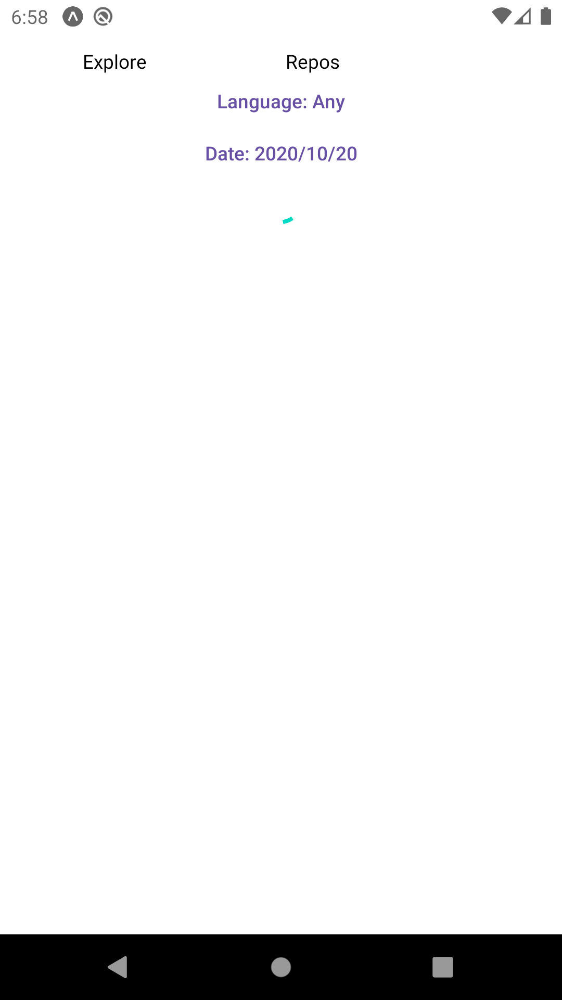
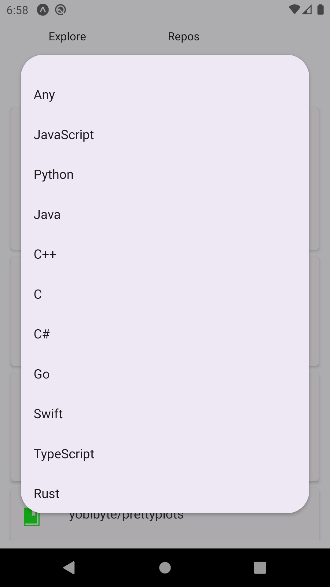
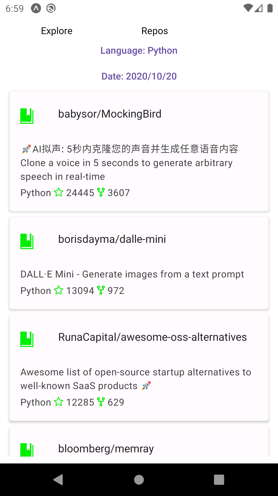
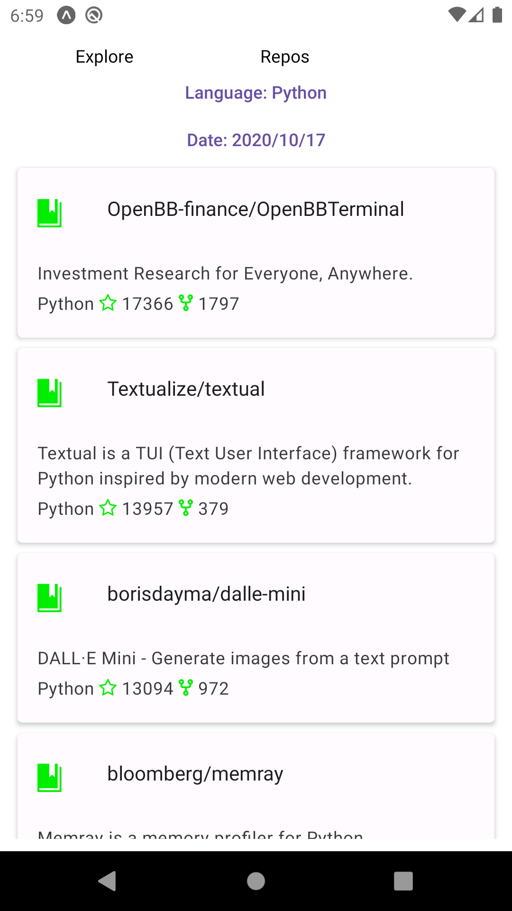

# How to Run:

```bash
git clone https://github.com/OmarThinks/github-task/
cd github-task/react-native-app
npm install
```

### Running on Android:

```bash
npm run android
```

### Running on web:

```bash
npm run web
```

## Texhnologies used:

- React, React Router
- Redux, Redux Toolkit (RTK), RTK Query
- React Native, React Native Paper

### Images:








### TODOS:

- Upgrade the layout to match the requirements
- Make pages refreshable

### Notes:

- I did have Adobe XD installed on my PC, so I tried to mimic the features in the link
